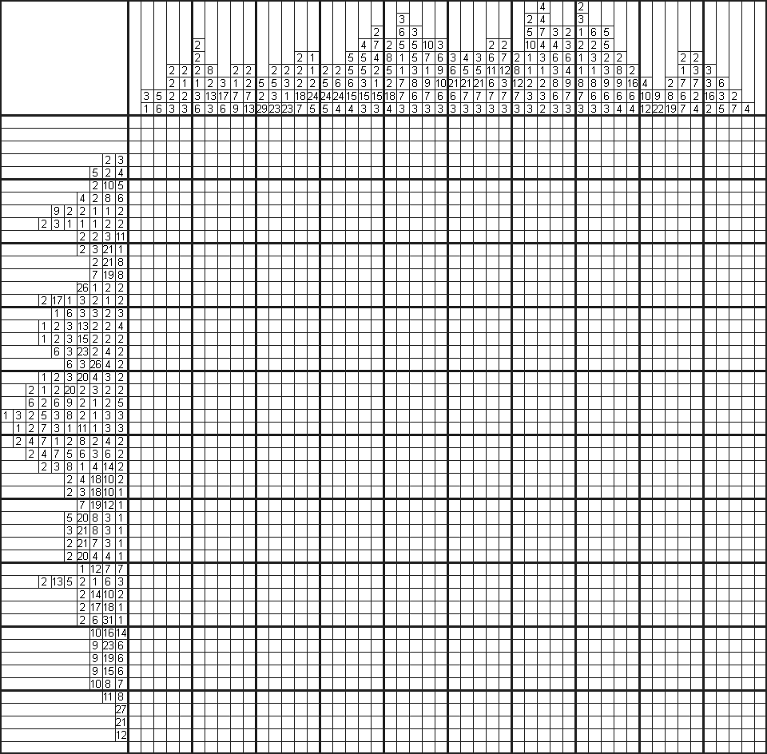
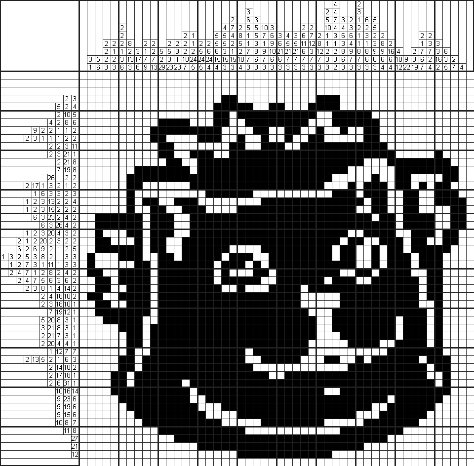

# Nonogram

**Nonogram**是一种逻辑游戏，以猜谜的方式绘画位图。在一个网格中，每一行和列都有一组数，玩家需根据它们来填满或留空格子，最后就可以由此得出一幅图画。例如，“4 8 3”的意思就是指该行或列上有三条独立的线，分别占了4、8和3格，而每条线最少要由一个空格分开。传统上，玩家是以黑色填满格子，和以“×”号标记一定不需要填充的格子。就此来看，这和踩地雷十分相似。但跟踩地雷不同的是，即使填错了格子，也不会即时出局。Nonogram是一个NP完全的问题。

Nonogram是在1987年由日本人西尾彻也发明的。在日本，Nonogram的名称是“**お絵かきロジック**”，意思是“绘画逻辑”。Nonogram初见于日本的谜题杂志，玩家用纸和笔来玩。

## 名称

Nonogram有着许多不同的名字，包括Paint by Numbers、Griddlers、Pic-a-Pix、Picross、Pixel Puzzles、Crucipixel、Edel、FigurePic、Grafilogika、Hanjie、Illust-Logic、Japanese Crosswords、Japanese Puzzles、Kare Karala!、Logic Art、Logic Square、Logicolor、Logik-Puzzles、Logimage、Zakókodované obrázky、Maľované krížovky、Oekaki Logic、Oekaki-Mate、Paint Logic、Shchor Uftor和Tsunami。

Nonogram至今还未有正式或广泛流传的中文名称，已知的中文名有：数织、数墙、填方块、逻辑拼图等。

## 解谜技巧

### 尽量的填充玩家可以利用数组尽量的填充格子。

如果数字等于行高或列寛的话，该行所有格仔都要填满。

如果不是的话，玩家则可以假设每条线只有由一个空格分隔，把线组推到可移动的空间的最尽；然后，把线组推到另一个尽头。两者重叠的填充部分就是一定要填充的格子。

### 尽量的标空

除了尽量的填充之外，玩家亦可以把一定不可能要填上的空格用“×”号标记起来，从而减少需要考虑的格子。

如果数字是零的话，该行所有格仔都需留空（玩家可用“×”号标上）。

即使不是零，玩家也可以根据已填充的格子，把线推到可移动的空间的最尽，再把线推到另一尽头。两者重叠的留空部分就是一定不需要填上的空格。

### 连接或分离邻近的线

如果两条邻近的线由一个空格分隔的话，玩家可以用以下的推论尝试把它填充或标空：

-   如果把它们连接起来，会令线条过长的话，该空格应该标空。
-   如果把它们分隔，会令线条数目过多的话，该空格应该填充。

### 利用矛盾推论

在一些难度较高的游戏中，玩家可能不能利用以上简单的推论方法来解谜。这时玩家可以先假定一个空格为需要填上的，然后继续解答。但当遇到矛盾的话，玩家需要把游戏回退到假定前的状态，因为矛盾证明了之前的假定是错误的。玩家亦可把该空格标空，因为它一定不是需要填充的格了。

## 程序示例

